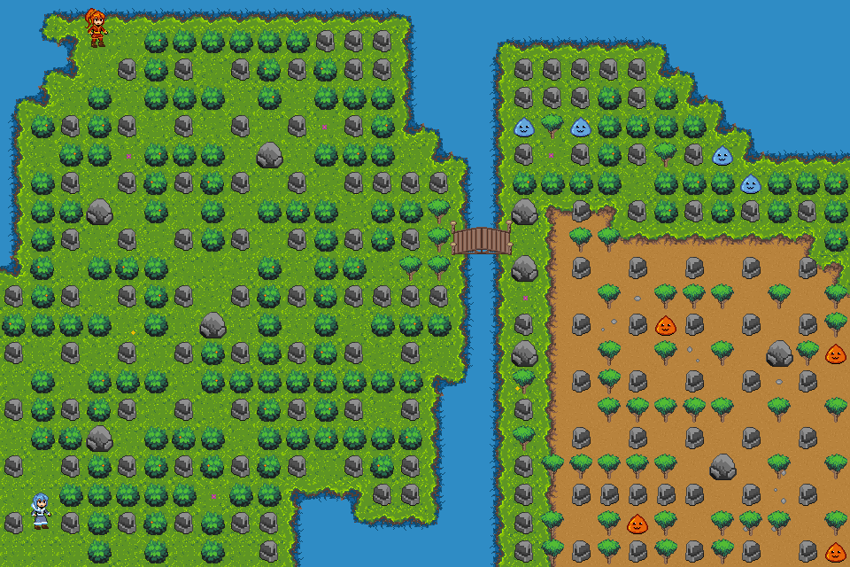

# Conceito atual

# Ferramentas

- Aseprite - Criar/editar Spritesheet onde é possível salvar como PNG, formato ideal para ser usado no MonoGame.
- - https://www.aseprite.org/ 

- Tiled - Usa os sprites criados no Aseprite para criar Tile Map por camadas e salvar as coordenadas como JSON (sempre usar a opção de incorporar conjunto de tiles no arquivo JSON para não ser necessário buscar informações externas nos arquivos TSX).
- - https://www.mapeditor.org/download.html 

- DotTiled - Dependência instalada via NuGet no Visual Studio, este lê o JSON criado no Tiled para renderizar o mapa no MonoGame.
- - Download via NuGet

# Uso das ferramentas

- Os arquivos com as imagens/texturas são inseridos no MonoGame, arquivo Content.mgcb. Ex.: TIL01.png e OBJ01.png. Estes arquivos são carregados no método Game1.LoadContent().  
- Dentro de LoadContent passamos as texturas para a classe TilemapRenderer, esta classe é responsável por ler as coordenadas do JSON e renderizar as texturas dos arquivos, lá é usada a dependência do DotTiled.  
- DotTiled serve apenas para ler os tiles/texturas do JSON em uma lista, quem renderiza é o MonoGame com spriteBatch.Draw().  
- O DotTiled tem classes internas predefinidas como TileLayer e ObjectLayer, essas classes estão no JSON e se referem as camadas de texturas criadas no Tiled, no exemplo a TileLayer recebe as coordenada para o arquivo TIL01 e a ObjectLayer recebe sobre o arquivo de textura OBJ01.

# Definições

- São apenas 4 direções disponíveis para movimentação, assim como no Bomberman.
- São 3 elementos magicos: Neutro, Gelo e Fogo.
- São 2 personagens, uma usa magia de Gelo e a outra de Fogo.
- Monstros e personagens tem até 3 pontos de vida.
- As personagens criam magias elementais que são colocadas no chão e detonam após alguns segundos, mesmo estilo de Bomberman. 
- As magias se espalham em esferas de chamas ou gelo para as 4 direções disponíveis e podem ser bloqueadas por blocos indestrutíveis.
- As magias tem alcance limitado que podem varias de 1~10 blocos, mas dependem de ser amplificadas com PowerUps espalhados pelo mapa.
- As personagens também tem ataques físicos/neutros.
- - Ataque físico é sempre Neutro, que não tem dano e efeito de Gelo nem Fogo e só podem ser feito próximo aos monstros/objetos.
- - O elemento Neutro é usado como magia pelos monstros do tipo Neutro.
- As personagens tem ataques mágicos especiais direcionados a uma direção, esses ataques só podem ser usados após alguma condição ainda não definida.
- - A condição de magias especiais pode ser através de itens obtidos pelo mapa ou drop de monstro, algo assim.
- As magias elementais devem ter efeitos distintos, como por exemplo:
- - Magia de gelo derrota monstro de fogo com 1 golpe (3 de dano).
- - Magia de gelo congela monstro neutro e o deixa imóvel mas não derrota se não der um golpe físico.
- - - Monstro congelado recebe 1 de dano no momento que é congelado, quando leva golpe físico recebe 1 de dano e se receber magia de fogo é derrotado.
- - - Monstro congelado pode ser empurrado.
- - Magia de gelo não causa dano nem efeito em monstro de gelo.
- - Magia de fogo derrota monstro de gelo com 1 golpe (3 de dano).
- - Magia de fogo queima monstro neutro que só é derrotado após um tempo queimando (1 de dano a cada 5s).
- - - Monstro queimando não recebe dano imediato, ou seja, só é derrotado nesse estado depois de 15s
- - - Monstro queimando se movimenta mais rápido e pode atacar os jogadores.
- - - Monstro queimando, se receber golpe físico, pode ser convertido em magia de fogo na direção do golpe e o monstro é derrotado (3 de dano).
- - Magia de fogo não funciona em monstro de fogo.
- Monstros tem 3 tipos: Neutro (verde), Gelo (azul) e Fogo (vermelho).
- Monstros de gelo e fogo podem usar magias de gelo e fogo que causam os mesmos efeitos assim como dos jogadores.
- Monstros de gelo e fogo podem usar ataque físico/neutro.
- Monstro neutro só causa dano neutro mas podem usar magias do tipo neutro.

# Etapas

- ✅ - Criar Tile Grounds básicos para iniciar os testes de renderização com o MonoGame.
- ✅ - Criar Tile Objetcts básicos para iniciar os testes de renderização com o MonoGame.
- ✅ - Puxar para o código as configurações de Tile Map geradas pelo Tiled e renderizar na tela.
- ✅ - Criar ajuste automático escalando o tamanho da tela de jogo com a resolução atual da maquina que está executando o jogo.
- 🔄 - (50%) Criar Sprites da personagem FireHair.  
- 🔄 - (20%) Criar Sprites da personagem IceBreath. 
- ⬜ - Criar classes de mapeamento de Joystick/Keyboard preparadas para receber alterações via menu em tempo de execução.  
- 🔄 - (60%) Criar classe que transfere comandos mapeados para a personagem e movimentar ela na tela.  
- 🔄 - (50%) Realizar o SpawnPoint dos players no mapa e controla-los na tela.  
- ⬜ - Criar classes de colisão com objetos para impedir que a personagem atravesse paredes ou saia da tela.  
- ⬜ - Criar sprites de objetos coletáveis ou destrutíveis.
- ⬜ - Criar interação da personagem com objetos coletáveis ou destrutíveis.  
- ⬜ - Criar Sprites para os inimigos se movimentarem na tela.
- ⬜ - Criar classe ou método para primeiro spawn de inimigos no mapa a partir da posição inicial definida no JSON do Tiled.  
- ⬜ - Criar sprites de efeitos visuais para danos em jogadores, inimigos, e poderes. 
- ⬜ - Criar interação da personagem com inimigos (monstro recebe ataque).  
- ⬜ - Criar interação dos inimigos com as personagens (personagem recebe ataque), os inimigos precisam detectar a presença do jogador e usar seus golpes disponíveis.  
- ⬜ - Criar menu inicial com Start Game o Options onde Start Game vai para a primeira tela disponível e Options será para configurar mapeamento de controles, áudio e vídeo.
- ⬜ - Criar uma tela de seleção de fases para teste.
- ⬜ - Criar uma tela no menu de pausa para habilitar/desabilitar PowerUp e debug para testes.
- ⬜ - Criar ao menos 10 fases.
- ⬜ - Criar World Map para progressão de fases do jogo.
- ⬜ - Criar arte de menu inicial com Splash Screeen.
- ⬜ - Criar/obter BGMs e Audio FX para o jogo.
- ⬜ - Criar enredo simples para abertura, diálogos durante o jogo e um final.
